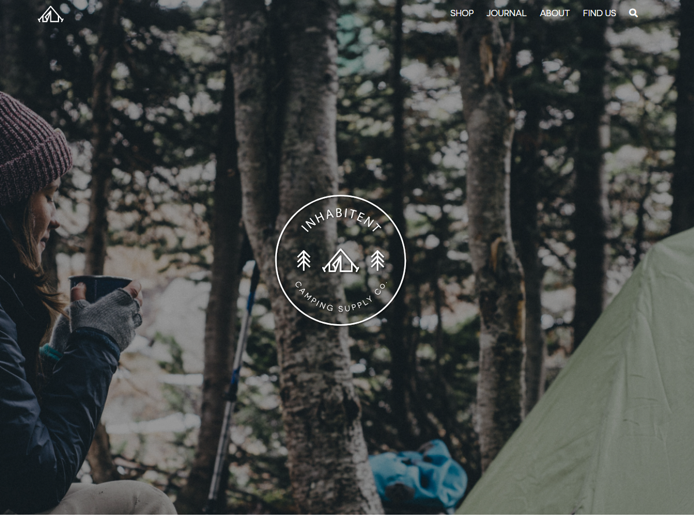

# Project 4 Inhabitent Wordpress site

This is a project containing custom wordpress template and a custom plugin for a website of Inhabitent company.
Custom plugin implements a widget for adding customizable Business Hours.

Project 4 for RED Academy Web Development course 2018.

URL: [Inhabitent](https://kachniss.com/inhabitent/)

## Author
* Katerina Vopalkova

## Based on
* [RED Starter Theme](https://github.com/redacademy/redstarter) (forked from Underscores)
* RED Widget Boilerplate

## Technologies used
* Gulp
* Sass
* jQuery
* Wordpress 
    * Custom Post Types
    * Custom Taxonomies
    * Custom Plugins
* Third party Wordpress plugins:
    * Contact Form 7
    * Custom Field Suite
    * Theme Check
    * WP User Avatar
    * WP-Optimize

## License
This project is licensed under the GPL license.